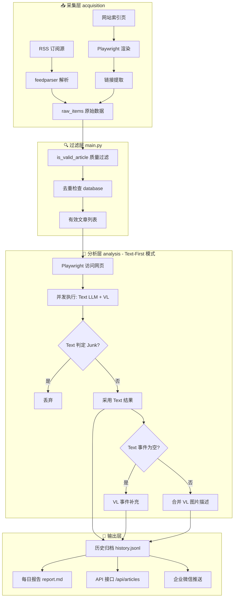

# DredgeScope（全球疏浚情报）

面向全球疏浚行业的情报采集、分析与可视化系统，支持新闻抓取、AI 分析、情报结构化提取、仪表盘展示与企业微信推送。

## 主要能力
- 多源新闻采集（RSS 订阅源 + 网站索引页抓取）
- AI 文本与视觉解析（标题翻译、摘要、事件抽取）
- 情报事件入库与可追溯归档
- 大屏仪表盘与历史新闻筛选
- 船舶跟踪与分布展示

## 快速启动（本地开发）

### Windows

1. 进入后端目录并安装依赖：

```bash
cd backend
pip install -r requirements.txt
```

2. 启动仪表盘服务：

```bash
.\run_dashboard.bat
```

3. 浏览器访问：

```
http://localhost:8000/
```

## Docker 部署

### 环境要求
- Docker >= 20.10
- Docker Compose >= 2.0

### 部署步骤

1. 上传项目到服务器

2. 配置环境变量，创建 `.env` 文件：

```bash
# AI 配置
AI_API_URL=https://ai.bim-ace.com/chat/v1/chat/completions
AI_MODEL=Qwen3-VL-30B-A3B-Instruct-FP8
AI_API_KEY=your_api_key

# 文本模型
TEXT_LLM_API_KEY=your_api_key
TEXT_LLM_MODEL=Qwen/Qwen2.5-7B-Instruct
TEXT_LLM_API_BASE=https://api.siliconflow.cn/v1

# 服务配置
WISEFLOW_BACKEND_URL=http://your_server_ip:8000
WECOM_WEBHOOK_URL=https://qyapi.weixin.qq.com/cgi-bin/webhook/send?key=your_key
```

3. 构建并启动：

```bash
docker-compose up -d --build
```

4. 查看日志：

```bash
docker-compose logs -f
```

5. 访问地址：`http://your_server_ip:8000/`

### 服务说明

| 服务 | 端口 | 说明 |
|------|------|------|
| dredge | 8000 | 前端 + API (Nginx + FastAPI) |
| scheduler | - | 定时任务 (信息抓取/报告推送) |

### 定时任务
- 信息抓取：00:00, 04:00, 07:30, 12:00, 16:00, 20:00
- 报告推送：08:00, 18:00
- 船舶追踪：每小时

### 常用命令

```bash
# 启动服务
docker-compose up -d

# 停止服务
docker-compose down

# 重启服务
docker-compose restart

# 查看日志
docker-compose logs -f

# 查看特定服务日志
docker-compose logs -f dredge
docker-compose logs -f scheduler
```

## 核心逻辑（新闻处理流程）

系统采用 **三层架构** 处理全球疏浚情报：



### 详细流程说明

#### 1. 采集层 (acquisition)
- **RSS 采集** (`info_acquisition.py`): 使用 `feedparser` 解析 RSS/Atom 订阅源
- **网页采集** (`info_acquisition.py`): 使用 Playwright 渲染动态网页，提取文章链接
- **数据源配置**: 来源定义在 `acquisition/sources.json`

#### 2. 过滤层 (main.py)
- **质量过滤** (`is_valid_article`): 过滤垃圾内容（404、Login页、空标题等）
- **去重检查**: 通过 `database.is_article_exists()` 检查链接是否已存在
- **时间过滤**: 只保留最近 24 小时内的文章

#### 3. 分析层 (analysis)
- **Text-First 模式**: `analyze_item` 函数采用文本优先策略
- **并发执行**: 同时调用 Text LLM (Qwen2.5) 和 VL (Qwen3-VL)
- **决策逻辑**:
  - Text 判定 Junk → 直接丢弃
  - Text 成功 → 采用 Text 结果
  - Text 事件为空 → VL 事件补充
  - 默认分类 → Market
- **VL 辅助**: 负责图片描述 + 当 Text 提取不到事件时补充

#### 4. 输出层
- **历史归档**: `backend/data/history.jsonl`（可追溯）
- **每日报告**: `backend/data/report.md`
- **API 接口**: FastAPI 提供 RESTful 接口
- **企业微信**: 自动推送日报到企业微信群

## 项目结构

```
dredgescope
├─ backend
│  ├─ acquisition
│  │  ├─ info_acquisition.py   # 新闻采集 (RSS + Web)
│  │  ├─ ship_status_fetcher.py # 船舶位置抓取
│  │  └─ sources.json          # 数据源配置
│  ├─ analysis
│  │  ├─ info_analysis.py      # AI 分析 (VL + LLM)
│  │  └─ vessel_analysis.py     # 船舶数据分析
│  ├─ reporting
│  │  ├─ dashboard_server.py   # FastAPI 服务
│  │  ├─ report_generation.py  # 报告生成
│  │  └─ wecom_push.py         # 企业微信推送
│  ├─ static
│  │  └─ continents.geojson    # 地图数据
│  ├─ config.py                # 配置
│  ├─ database.py              # 数据库操作
│  ├─ main.py                  # 主入口 (采集→分析→存储)
│  └─ scheduler.py             # 定时任务
├─ frontend
│  ├─ src                      # Vue 3 前端源码
│  └─ dist                     # 构建产物
├─ nginx.conf                  # Nginx 配置
├─ Dockerfile                  # Docker 镜像
├─ docker-compose.yml          # 容器编排
├─ scheduler_entry.py          # 调度器入口
└─ run_dashboard.bat           # 本地启动脚本
```

## 运行要点
- Python 版本：建议 3.10+
- 依赖安装：backend/requirements.txt
- 运行入口：run_dashboard.bat
