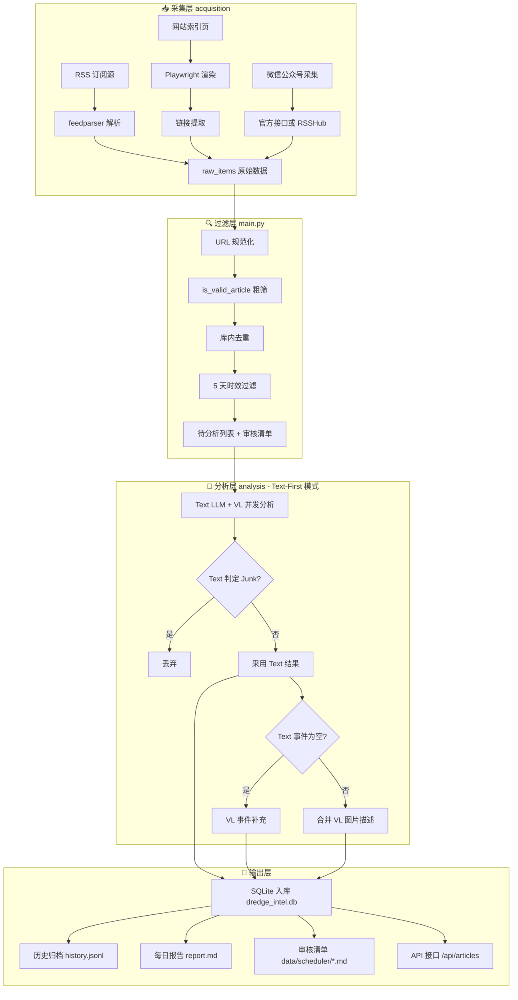

# DredgeScope（全球疏浚情报）

面向全球疏浚行业的情报采集、分析与可视化系统，支持新闻抓取、AI 分析、情报结构化提取、仪表盘展示与企业微信推送。

## 主要能力
- 多源新闻采集（RSS 订阅源 + 网站索引页抓取）
- AI 文本与视觉解析（标题翻译、摘要、事件抽取）
- 情报事件入库与可追溯归档
- 大屏仪表盘与历史新闻筛选
- 船舶跟踪与分布展示


## 核心逻辑（新闻处理流程）

系统采用 **三层架构** 处理全球疏浚情报：



### 详细流程说明

#### 1. 采集层 (acquisition)
- **RSS 采集** (`info_acquisition.py`): 使用 `feedparser` 解析 RSS/Atom 订阅源
- **网页采集** (`info_acquisition.py`): Playwright 渲染动态网页，提取文章链接与正文
- **微信公众号采集** (`wechat_acquisition.py`): 官方接口优先，失败回退到 RSSHub
- **数据源配置**: 来源定义在 `backend/static/sources.json`
- **微信凭证**: 写入 `backend/static/wechat_session.json`，可用 `backend/scripts/init_wechat_session.py` 初始化

#### 2. 过滤层 (main.py)
- **URL 规范化**: 移除追踪参数与片段，避免重复
- **质量过滤** (`is_valid_article`): 过滤空标题、导航页、异常标题等
- **去重检查**: 任务内去重 + 数据库去重
- **时间过滤**: 过滤早于 5 天的新闻
- **审核清单**: 输出到 `backend/data/scheduler/*.md`

#### 3. 分析层 (analysis)
- **Text-First 模式**: `info_analysis.py` 文本优先，必要时补充视觉结果
- **并发执行**: 同时调用 Text LLM 与 VL 模型
- **决策逻辑**:
  - Text 判定 Junk → 直接丢弃
  - Text 成功 → 采用 Text 结果
  - Text 事件为空 → VL 事件补充
  - 默认分类 → Market
- **VL 辅助**: 图片描述 + 事件补充

#### 4. 输出层
- **SQLite 入库**: `backend/data/dredge_intel.db`
- **历史归档**: `backend/data/history.jsonl`
- **每日报告**: `backend/data/report.md`
- **审核清单**: `backend/data/scheduler/*.md`
- **API 接口**: FastAPI 提供 RESTful 接口

## 项目结构

```
dredgescope
├─ backend
│  ├─ acquisition
│  │  ├─ info_acquisition.py   # 新闻采集 (RSS + Web)
│  │  ├─ wechat_acquisition.py # 微信公众号采集
│  │  └─ ship_status_fetcher.py # 船舶位置抓取
│  ├─ analysis
│  │  ├─ info_analysis.py      # AI 分析 (VL + LLM)
│  │  └─ ships_status.py       # 船舶状态分析
│  ├─ reporting
│  │  ├─ dashboard_server.py   # FastAPI 服务
│  │  ├─ report_generation.py  # 报告生成
│  │  └─ wecom_push.py         # 企业微信推送
│  ├─ scripts
│  │  ├─ init_ships.py         # 初始化船舶数据
│  │  └─ init_wechat_session.py # 微信凭证初始化
│  ├─ static
│  │  ├─ constants.py          # 分类与抽取规则
│  │  ├─ continents.geojson    # 地图数据
│  │  └─ sources.json          # 数据源配置
│  ├─ config.py                # 配置
│  ├─ database.py              # 数据库操作
│  ├─ main.py                  # 主入口 (采集→分析→存储)
│  └─ scheduler.py             # 定时任务
├─ frontend
│  ├─ src                      # Vue 3 前端源码
│  └─ dist                     # 构建产物
├─ tests                        # 测试用例
├─ nginx.conf                   # Nginx 配置
├─ Dockerfile                   # Docker 镜像
├─ docker-compose.yml           # 容器编排
├─ run_backend.bat              # 后端启动脚本
├─ run_frontend.bat             # 前端启动脚本
└─ run_scheduler.bat            # 调度器启动脚本
```

## 运行要点
- Python 版本：建议 3.10+
- Node.js 版本：建议 18.12+，pnpm 7+
- 后端依赖：backend/requirements.txt
- 前端依赖：frontend/package.json
- 单次采集入口：`cd backend && python main.py`
- 定时任务入口：`run_scheduler.bat`


flowchart TB
    subgraph 采集层["📥 采集层 acquisition"]
        S1[sources.json 数据源配置] --> RSS[RSS 抓取]
        S1 --> WEB[Web 索引抓取]
        S1 --> WECHAT[微信公众号采集]
        RSS --> RAW[raw_items 原始候选]
        WEB --> RAW
        WECHAT --> RAW
    end

    subgraph 过滤层["🔍 过滤层 main.py"]
        RAW --> NORM[URL 规范化]
        NORM --> BASIC[标题/链接有效性]
        BASIC --> DEDUP[任务内去重 + 数据库去重]
        DEDUP --> TIME[发布时间 5 天窗口]
        TIME --> PENDING[待分析列表 items]
        TIME --> AUDIT[审核清单 scheduler/*.md]
    end

    subgraph 入库层["💾 入库 - 原始记录"]
        PENDING --> RAWDB[save_raw_articles 入库 articles]
    end

    subgraph 分析层["🤖 分析层 info_analysis.py"]
        RAWDB --> TEXT[Text LLM]
        RAWDB --> VL[视觉 VL 模型]
        TEXT --> MERGE[Text优先 + VL补充]
        VL --> MERGE
        MERGE --> REL[相关性判定 is_relevant_news]
        REL --> RESULT[结果结构化: title_cn/summary/events/category]
    end

    subgraph 输出层["📦 输出层 reporting + database"]
        RESULT --> SAVE[save_history -> save_article_and_events]
        SAVE --> DB[(SQLite: articles/events/event_groups)]
        SAVE --> REPORT[report.md + scheduler审核]
    end

    subgraph 展示层["🖥️ 展示 API"]
        DB --> API1[/api/articles 列表/筛选]
        DB --> API2[/api/article/{id} 详情]
        DB --> API3[/api/sources /api/scheduler]
    end

    subgraph 推送层["📨 企业微信推送"]
        DB --> PUSH[push_daily_report]
        PUSH --> WECOM[Webhook 模板卡/降级文本]
    end