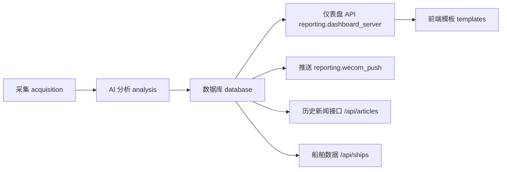

# DredgeScope（全球疏浚情报）

面向全球疏浚行业的情报采集、分析与可视化系统，支持新闻抓取、AI 分析、情报结构化提取、仪表盘展示与企业微信推送。

## 主要能力
- 多源新闻采集（RSS/网页）
- AI 文本与视觉解析（标题翻译、摘要、事件抽取）
- 情报事件入库与可追溯归档
- 大屏仪表盘与历史新闻筛选
- 船舶跟踪与分布展示

## 快速启动（Windows）
1. 进入后端目录并安装依赖：

```bash
cd backend
pip install -r requirements.txt
```

2. 启动仪表盘服务：

```bash
.\run_dashboard.bat
```

3. 浏览器访问：

```
http://localhost:8000/
```

## 项目结构

```
d:\AI\DregingIntelligence
├─ backend
│  ├─ acquisition        # 情报采集（RSS/网页）
│  ├─ analysis           # AI 分析与结构化提取
│  ├─ reporting          # Dashboard 接口与推送
│  ├─ static             # 静态资源（地图等）
│  ├─ templates          # 前端模板（大屏/历史/船舶）
│  ├─ config.py          # 配置
│  ├─ database.py        # 数据库模型与访问
│  ├─ main.py            # 入口
│  └─ scheduler.py       # 定时任务
├─ run_dashboard.bat     # 启动仪表盘
├─ run_scheduler.bat     # 启动定时任务
└─ ships.csv             # 船舶基础数据
```

## 结构与数据流



## 运行要点
- Python 版本：建议 3.10+
- 依赖安装：backend/requirements.txt
- 运行入口：run_dashboard.bat

