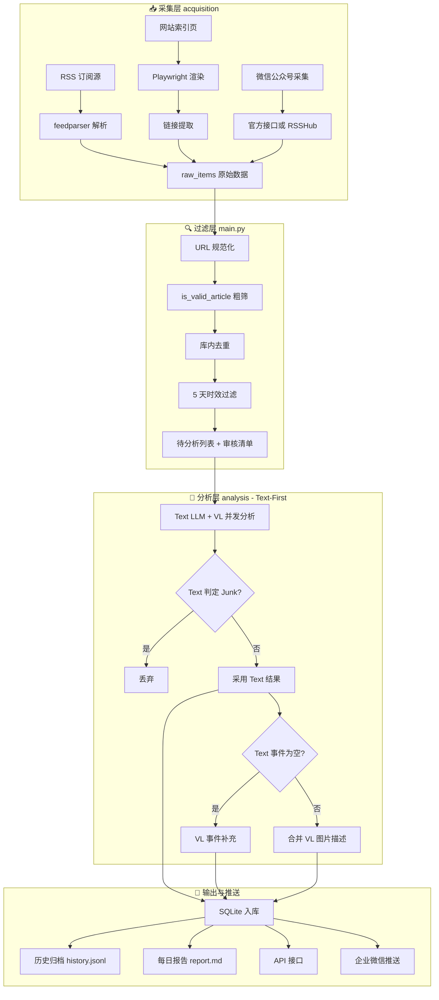

# DredgeScope（全球疏浚情报）

面向全球疏浚行业的情报采集、分析与可视化系统，支持新闻抓取、AI 分析、情报结构化提取、仪表盘展示与企业微信推送。

## 主要能力
- **多源新闻采集**：RSS 订阅源 + 网站索引页抓取 + 微信公众号
- **AI 智能分析**：基于 LLM 与 VLM 进行标题翻译、摘要生成、事件抽取与垃圾信息过滤
- **情报归档**：结构化入库与可追溯归档
- **可视化展示**：大屏仪表盘、历史新闻筛选、船舶跟踪与分布展示
- **自动推送**：每日生成简报并推送到企业微信

## 新闻数据源

当前系统监控 **28** 个全球疏浚行业核心数据源，覆盖国际主流媒体、行业协会、主要承包商及中国官方渠道。

### 1. 数据源分布

| 类型 | 数量 | 占比 | 采集策略 | 特点 |
| :--- | :--- | :--- | :--- | :--- |
| **Web (网页)** | 18 | 64% | Playwright 动态渲染 + 智能选择器 | 覆盖面广，支持反爬虫对抗，含黑名单过滤 |
| **RSS (订阅)** | 6 | 21% | Feedparser 标准解析 | 实时性高，结构化好 |
| **WeChat (公众号)** | 4 | 14% | 官方 Session 接口 (优先) / RSSHub (回退) | 深度中文内容，覆盖中交系核心大局 |
| **总计** | **28** | 100% | 混合采集模式 | 全方位覆盖 |

### 2. 重点覆盖领域

#### 🌍 国际行业媒体
- **Dredging Today / DredgeWire**: 行业头部即时新闻
- **MarineLog / Waterways Journal**: 侧重内河与航运工程
- **Pile Buck Magazine**: 桩基与海洋工程技术

#### 🏢 国际承包商
- **四大疏浚巨头**: Jan De Nul, Van Oord, Boskalis, DEME
- **美国**: Great Lakes Dredge & Dock (GLDD)

#### 🏛️ 行业协会与官方机构
- **IADC / CEDA**: 国际疏浚协会与中部疏浚协会
- **USACE (美国陆军工程兵团)**: 官方项目与招标信息
- **WEDA / NWC**: 美洲相关疏浚组织

#### 🇨🇳 中国核心渠道
- **中交集团 (CCCC)**: 疏浚、天航局、上航局、广航局（官网 + 公众号双备份）
- **中国疏浚协会 (CHIDA)**: 行业官方动态

## 核心逻辑与架构

系统采用 **三层架构** 处理全球疏浚情报：


```mermaid
flowchart TB
    subgraph 采集层["📥 采集层 acquisition"]
        A1[RSS 订阅源] --> A2[feedparser 解析]
        A3[网站索引页] --> A4[Playwright 渲染]
        A4 --> A5[链接提取]
        A6[微信公众号采集] --> A7[官方接口或 RSSHub]
        A2 --> A8[raw_items 原始数据]
        A5 --> A8
        A7 --> A8
    end

    subgraph 过滤层["🔍 过滤层 main.py"]
        A8 --> B1[URL 规范化]
        B1 --> B2[is_valid_article 粗筛]
        B2 --> B3[库内去重]
        B3 --> B4[5 天时效过滤]
        B4 --> B5[待分析列表 + 审核清单]
    end

    subgraph 分析层["🤖 分析层 analysis - Text-First"]
        B5 --> C1[Text LLM + VL 并发分析]
        C1 --> C2{Text 判定 Junk?}
        C2 -- 是 --> C3[丢弃]
        C2 -- 否 --> C4[采用 Text 结果]
        C4 --> C5{Text 事件为空?}
        C5 -- 是 --> C6[VL 事件补充]
        C5 -- 否 --> C7[合并 VL 图片描述]
    end

    subgraph 输出与推送["💾 输出与推送"]
        C4 --> D1[SQLite 入库]
        C6 --> D1
        C7 --> D1
        D1 --> D2[历史归档 history.jsonl]
        D1 --> D3[每日报告 report.md]
        D1 --> D5[API 接口]
        D1 --> PUSH[企业微信推送]
    end
```

### 流程说明

1.  **采集层 (Acquisition)**
    - **RSS**: 实时获取结构化数据。
    - **Web**: 使用 Playwright 渲染动态网页，智能提取正文。
    - **WeChat**: 优先使用 Session 接口，RSSHub 作为兜底。

2.  **过滤层 (Filter)**
    - **去重**: 任务内去重 + 数据库历史比对。
    - **清洗**: 过滤无效页面（Login, About Us 等）和过期新闻（>5天）。

3.  **分析层 (Analysis)**
    - **Text-First 策略**: 优先依赖文本大模型进行分类和摘要。
    - **视觉增强**: 当文本无法提取事件时，利用 VL 模型分析新闻图片补充信息。
    - **垃圾过滤**: AI 自动识别并剔除无关内容。

4.  **输出层 (Output)**
    - 数据持久化到 SQLite 和 JSONL。
    - 生成 Markdown 日报。
    - 通过企业微信 Webhook 推送消息卡片。

## 项目结构

```
dredgescope
├─ backend
│  ├─ acquisition      # 采集模块 (RSS, Web, WeChat, Ship)
│  ├─ analysis         # 分析模块 (LLM, VL)
│  ├─ reporting        # 报告与推送 (Dashboard API, Report, WeCom)
│  ├─ static           # 静态配置 (Sources, GeoJSON)
│  ├─ data             # 数据存储 (DB, Logs)
│  ├─ config.py        # 全局配置
│  ├─ main.py          # 采集任务入口
│  └─ scheduler.py     # 调度器
├─ frontend            # Vue 3 + TypeScript 前端
│  ├─ src/views        # 页面 (Dashboard, Map, etc.)
│  └─ vite.config.ts   # 构建配置
├─ docker-compose.yml  # 容器编排
└─ requirements.txt    # 后端依赖
```

## 运行指南

### 环境要求
- **Python**: 3.11+
- **Node.js**: 18.12+ (pnpm 7+)
- **Chrome/Chromium**: 用于 Playwright

### 快速开始

1.  **安装依赖**:
    ```bash
    # 后端
    cd backend
    pip install -r requirements.txt
    playwright install chromium

    # 前端
    cd frontend
    pnpm install
    ```

2.  **配置环境**:
    在项目根目录创建 `.env` 文件，配置 API Key 和数据库路径（参考 `backend/config.py`）。

3.  **启动项目**:
    - **本地开发**: 运行 `run_dev.bat` (Windows)
    - **Docker**: `docker-compose up -d --build`
    - **单次采集**: `cd backend && python main.py`
