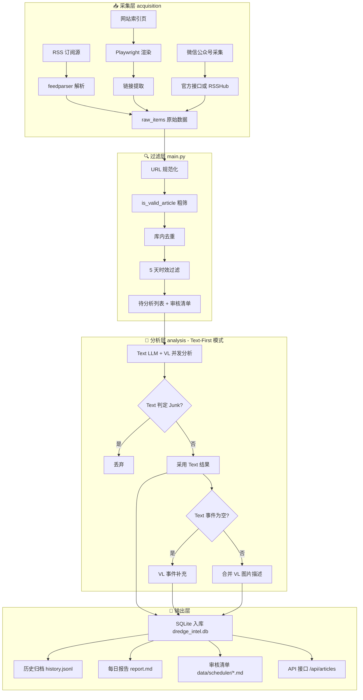

# DredgeScope（全球疏浚情报）

面向全球疏浚行业的情报采集、分析与可视化系统，支持新闻抓取、AI 分析、情报结构化提取、仪表盘展示与企业微信推送。

## 主要能力
- 多源新闻采集（RSS 订阅源 + 网站索引页抓取）
- AI 文本与视觉解析（标题翻译、摘要、事件抽取）
- 情报事件入库与可追溯归档
- 大屏仪表盘与历史新闻筛选
- 船舶跟踪与分布展示

## 新闻数据源分析

当前系统监控 **28** 个全球疏浚行业核心数据源，覆盖国际主流媒体、行业协会、主要承包商及中国官方渠道。

### 1. 数据源分布

| 类型 | 数量 | 占比 | 采集策略 | 特点 |
| :--- | :--- | :--- | :--- | :--- |
| **Web (网页)** | 18 | 64% | Playwright 动态渲染 + 智能选择器 | 覆盖面广，支持反爬虫对抗，含黑名单过滤 |
| **RSS (订阅)** | 6 | 21% | Feedparser 标准解析 | 实时性高，结构化好，但部分源内容简略 |
| **WeChat (公众号)** | 4 | 14% | 官方 Session 接口 (优先) / RSSHub (回退) | 深度中文内容，需处理 Session 过期与反爬 |
| **总计** | **28** | 100% | 混合采集模式 | 全方位覆盖 |

### 2. 重点覆盖领域

#### 🌍 国际行业媒体 (RSS/Web)
- **Dredging Today / DredgeWire**: 行业头部即时新闻
- **MarineLog / Waterways Journal**: 侧重内河与航运工程
- **Pile Buck Magazine**: 桩基与海洋工程技术

#### 🏢 国际承包商 (Web)
- **四大疏浚巨头**: Jan De Nul, Van Oord, Boskalis, DEME
- **美国**: Great Lakes Dredge & Dock (GLDD)

#### 🏛️ 行业协会与官方机构 (Web)
- **IADC / CEDA**: 国际疏浚协会与中部疏浚协会
- **USACE (美国陆军工程兵团)**: 官方项目与招标信息
- **WEDA / NWC**: 美洲相关疏浚组织

#### 🇨🇳 中国核心渠道 (Web/WeChat)
- **中交集团 (CCCC)**: 疏浚、天航局、上航局、广航局（官网 + 公众号双备份）
- **中国疏浚协会 (CHIDA)**: 行业官方动态

### 3. 采集与过滤策略
- **去重机制**: 任务内去重 + 数据库历史比对，确保不重复抓取。
- **无效拦截**: 自动过滤 "Login", "About Us", "Contact" 等非新闻页面，但保留记录（标记为 `valid=0`）以避免重复扫描。
- **时效控制**: 优先入库 5 天内的新闻；过期新闻自动标记归档。

## 核心逻辑（新闻处理流程）

系统采用 **三层架构** 处理全球疏浚情报：


```mermaid
flowchart TB
    subgraph 采集层["📥 采集层 acquisition"]
        A1[RSS 订阅源] --> A2[feedparser 解析]
        A3[网站索引页] --> A4[Playwright 渲染]
        A4 --> A5[链接提取]
        A6[微信公众号采集] --> A7[官方接口或 RSSHub]
        A2 --> A8[raw_items 原始数据]
        A5 --> A8
        A7 --> A8
    end

    subgraph 过滤层["🔍 过滤层 main.py"]
        A8 --> B1[URL 规范化]
        B1 --> B2[is_valid_article 粗筛]
        B2 --> B3[库内去重]
        B3 --> B4[5 天时效过滤]
        B4 --> B5[待分析列表 + 审核清单]
    end

    subgraph 分析层["🤖 分析层 analysis - Text-First 模式"]
        B5 --> C1[Text LLM + VL 并发分析]
        C1 --> C2{Text 判定 Junk?}
        C2 -- 是 --> C3[丢弃]
        C2 -- 否 --> C4[采用 Text 结果]
        C4 --> C5{Text 事件为空?}
        C5 -- 是 --> C6[VL 事件补充]
        C5 -- 否 --> C7[合并 VL 图片描述]
    end

    subgraph 输出层["💾 输出层"]
        C4 --> D1[SQLite 入库 dredge_intel.db]
        C6 --> D1
        C7 --> D1
        D1 --> D2[历史归档 history.jsonl]
        D1 --> D3[每日报告 report.md]
        D1 --> D4[审核清单 data/scheduler/*.md]
        D1 --> D5[API 接口 /api/articles]
    end
```

### 详细流程说明

#### 1. 采集层 (acquisition)
- **RSS 采集** (`info_acquisition.py`): 使用 `feedparser` 解析 RSS/Atom 订阅源
- **网页采集** (`info_acquisition.py`): Playwright 渲染动态网页，提取文章链接与正文
- **微信公众号采集** (`wechat_acquisition.py`): 官方接口优先，失败回退到 RSSHub
- **数据源配置**: 来源定义在 `backend/static/sources.json`
- **微信凭证**: 写入 `backend/static/wechat_session.json`，可用 `backend/scripts/init_wechat_session.py` 初始化

#### 2. 过滤层 (main.py)
- **URL 规范化**: 移除追踪参数与片段，避免重复
- **质量过滤** (`is_valid_article`): 过滤空标题、导航页、异常标题等
- **去重检查**: 任务内去重 + 数据库去重
- **时间过滤**: 过滤早于 5 天的新闻
- **审核清单**: 输出到 `backend/data/scheduler/*.md`

#### 3. 分析层 (analysis)
- **Text-First 模式**: `info_analysis.py` 文本优先，必要时补充视觉结果
- **并发执行**: 同时调用 Text LLM 与 VL 模型
- **决策逻辑**:
  - Text 判定 Junk → 直接丢弃
  - Text 成功 → 采用 Text 结果
  - Text 事件为空 → VL 事件补充
  - 默认分类 → Market
- **VL 辅助**: 图片描述 + 事件补充

#### 4. 输出层
- **SQLite 入库**: `backend/data/dredge_intel.db`
- **历史归档**: `backend/data/history.jsonl`
- **每日报告**: `backend/data/report.md`
- **审核清单**: `backend/data/scheduler/*.md`
- **API 接口**: FastAPI 提供 RESTful 接口

## 项目结构

```
dredgescope
├─ backend
│  ├─ acquisition
│  │  ├─ info_acquisition.py   # 新闻采集 (RSS + Web)
│  │  ├─ wechat_acquisition.py # 微信公众号采集
│  │  └─ ship_status_fetcher.py # 船舶位置抓取
│  ├─ analysis
│  │  ├─ info_analysis.py      # AI 分析 (VL + LLM)
│  │  └─ ships_status.py       # 船舶状态分析
│  ├─ reporting
│  │  ├─ dashboard_server.py   # FastAPI 服务
│  │  ├─ report_generation.py  # 报告生成
│  │  └─ wecom_push.py         # 企业微信推送
│  ├─ scripts
│  │  ├─ init_ships.py         # 初始化船舶数据
│  │  └─ init_wechat_session.py # 微信凭证初始化
│  ├─ static
│  │  ├─ constants.py          # 分类与抽取规则
│  │  ├─ continents.geojson    # 地图数据
│  │  └─ sources.json          # 数据源配置
│  ├─ config.py                # 配置
│  ├─ database.py              # 数据库操作
│  ├─ main.py                  # 主入口 (采集→分析→存储)
│  └─ scheduler.py             # 定时任务
├─ frontend
│  ├─ src                      # Vue 3 前端源码
│  └─ dist                     # 构建产物
├─ tests                        # 测试用例
├─ nginx.conf                   # Nginx 配置
├─ Dockerfile                   # Docker 镜像
├─ docker-compose.yml           # 容器编排
├─ run_backend.bat              # 后端启动脚本
├─ run_frontend.bat             # 前端启动脚本
├─ run_scheduler.bat            # 调度器启动脚本
```

## 运行要点
- Python 版本：建议 3.10+
- Node.js 版本：建议 18.12+，pnpm 7+
- 后端依赖：backend/requirements.txt
- 前端依赖：frontend/package.json
- 单次采集入口：`cd backend && python main.py`
- 定时任务入口：`run_scheduler.bat`


flowchart TB
    subgraph 采集层["📥 采集层 acquisition"]
        S1[sources.json 数据源配置] --> RSS[RSS 抓取]
        S1 --> WEB[Web 索引抓取]
        S1 --> WECHAT[微信公众号采集]
        RSS --> RAW[raw_items 原始候选]
        WEB --> RAW
        WECHAT --> RAW
    end

    subgraph 过滤层["🔍 过滤层 main.py"]
        RAW --> NORM[URL 规范化]
        NORM --> BASIC[标题/链接有效性]
        BASIC --> DEDUP[任务内去重 + 数据库去重]
        DEDUP --> TIME[发布时间 5 天窗口]
        TIME --> PENDING[待分析列表 items]
        TIME --> AUDIT[审核清单 scheduler/*.md]
    end

    subgraph 入库层["💾 入库 - 原始记录"]
        PENDING --> RAWDB[save_raw_articles 入库 articles]
    end

    subgraph 分析层["🤖 分析层 info_analysis.py"]
        RAWDB --> TEXT[Text LLM]
        RAWDB --> VL[视觉 VL 模型]
        TEXT --> MERGE[Text优先 + VL补充]
        VL --> MERGE
        MERGE --> REL[相关性判定 is_relevant_news]
        REL --> RESULT[结果结构化: title_cn/summary/events/category]
    end

    subgraph 输出层["📦 输出层 reporting + database"]
        RESULT --> SAVE[save_history -> save_article_and_events]
        SAVE --> DB[(SQLite: articles/events/event_groups)]
        SAVE --> REPORT[report.md + scheduler审核]
    end

    subgraph 展示层["🖥️ 展示 API"]
        DB --> API1[/api/articles 列表/筛选]
        DB --> API2[/api/article/{id} 详情]
        DB --> API3[/api/sources /api/scheduler]
    end

    subgraph 推送层["📨 企业微信推送"]
        DB --> PUSH[push_daily_report]
        PUSH --> WECOM[Webhook 模板卡/降级文本]
    end

## 新闻数据源分析

截至目前，系统共配置了 **27** 个数据源，覆盖全球主要的疏浚行业信息渠道。

### 1. 总体分布

| 类型 | 数量 | 占比 | 说明 |
| :--- | :--- | :--- | :--- |
| **Web (网页爬虫)** | 17 | 63% | 包括国际疏浚组织、各国疏浚企业官网、政府机构新闻页。通过 Playwright 动态抓取。 |
| **RSS (订阅)** | 6 | 22% | 专业的行业新闻聚合网站，更新频率较高。 |
| **WeChat (公众号)** | 4 | 15% | 中国四大疏浚局官方公众号。支持 Session 抓取（优先）和 RSSHub 回退。 |
| **总计** | **27** | 100% | |

### 2. 详细列表

#### 国际行业媒体 (8 个)
1. **Dredging Today** (RSS) - 全球疏浚行业新闻
2. **DredgeWire** (RSS) - 疏浚与海洋建设资讯
3. **MarineLog Dredging** (RSS) - 海事日志疏浚版块
4. **Waterways Journal** (RSS) - 内河航运与疏浚
5. **Pile Buck Magazine** (RSS) - 深基坑与桩基工程
6. **IADC Dredging** (Web) - 国际疏浚公司协会
7. **CEDA Industry News** (Web) - 中东部疏浚协会
8. **Dredging Contractors of America** (Web) - 美国疏浚承包商协会

#### 国际大型疏浚公司 (5 个)
9. **Jan De Nul** (Web) - 比利时扬德努集团
10. **Van Oord** (Web) - 荷兰凡诺德公司
11. **Boskalis** (Web) - 荷兰波斯卡利斯
12. **DEME Group** (Web) - 比利时DEME集团
13. **Great Lakes Dredge & Dock** (RSS) - 美国大湖疏浚

#### 中国核心疏浚企业 (5 个)
14. **中国疏浚协会** (Web) - 行业协会官网
15. **中交疏浚 (CCCC-CDC)** (Web + WeChat)
16. **中交天航局 (CCCC-TDC)** (Web + WeChat)
17. **中交广航局 (CCCC-GDC)** (Web + WeChat)
18. **中交上航局 (CCCC-SDC)** (Web + WeChat)

#### 美国政府与相关机构 (6 个)
19. **USACE Navigation Gateway** (Web) - 美国陆军工程兵团导航门户
20. **USACE Navigation Experience** (Web) - 美国陆军工程兵团数据平台
21. **BOEM Environment** (Web) - 美国海洋能源管理局
22. **Atlantic Intracoastal Waterway Association** (Web) - 大西洋沿岸水道协会
23. **American Maritime Partnership** (Web) - 美国海事伙伴关系
24. **National Waterways Conference** (Web) - 国家水道会议

### 3. 采集策略
- **RSS**: 优先使用，实时性高，无需解析页面结构。
- **Web**: 针对无RSS的网站，使用 `Playwright` 模拟浏览器访问，支持动态加载内容。
  - **智能去重**: 采集前对比数据库，仅抓取新文章。
  - **黑名单过滤**: 自动过滤关于/联系/委员会等非新闻页面。
- **WeChat**: 
  - **双重策略**: 优先使用官方接口（需Session），失效时自动降级至 RSSHub 镜像。
  - **全面覆盖**: 包含四大中交系疏浚局的核心发布渠道。

## 开发指南

```
