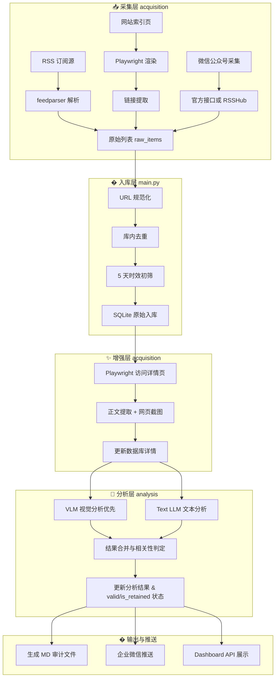

# DredgeScope（全球疏浚情报）

面向全球疏浚行业的情报采集、分析与可视化系统，支持新闻抓取、AI 分析、情报结构化提取、仪表盘展示与企业微信推送。

## 主要能力
- **多源新闻采集**：RSS 订阅源 + 网站索引页抓取 + 微信公众号
- **AI 智能分析**：基于 LLM 与 VLM 进行标题翻译、摘要生成、事件抽取与垃圾信息过滤
- **情报归档**：结构化入库与可追溯归档
- **可视化展示**：大屏仪表盘（自动适配早/晚报时段）、历史新闻筛选、船舶跟踪与分布展示（支持天地图/ArcGIS 切换）
- **自动推送**：每日生成简报并推送到企业微信

## 新闻数据源

当前系统监控 **28** 个全球疏浚行业核心数据源，覆盖国际主流媒体、行业协会、主要承包商及中国官方渠道。

### 1. 数据源分布

| 类型 | 数量 | 占比 | 采集策略 | 特点 |
| :--- | :--- | :--- | :--- | :--- |
| **Web (网页)** | 18 | 64% | Playwright 动态渲染 + 智能选择器 | 覆盖面广，支持反爬虫对抗，包含中交系官网 |
| **RSS (订阅)** | 6 | 21% | Feedparser 标准解析 | 实时性高，结构化好，包含行业主流媒体 |
| **WeChat (公众号)** | 4 | 14% | 官方 Session 接口 (优先) / RSSHub (回退) | 深度中文内容，覆盖中交系核心大局 |
| **总计** | **28** | 100% | 混合采集模式 | 全方位覆盖 |

### 2. 完整数据源清单

#### 🌍 国际行业媒体 (RSS)
- **Dredging Today**: 行业头部，全方位报道
- **DredgeWire**: 国际即时资讯
- **MarineLog (Dredging)**: 海事与航道工程
- **Waterways Journal**: 内河与航道开发
- **Pile Buck Magazine**: 桩基与海洋工程
- **Great Lakes Dredge & Dock (GLDD)**: 美国最大疏浚商投资者关系

#### 🏢 国际承包商与组织 (Web)
- **四大疏浚巨头**: Jan De Nul, Van Oord, Boskalis, DEME
- **行业协会**: IADC (国际疏浚协会), CEDA (中部疏浚协会), DCA (美洲疏浚商协会)
- **官方机构**: USACE (美国陆军工程兵团 - 2个频道), BOEM (海洋能源管理局)
- **区域组织**: AIWA (大西洋沿岸水道协会), AMP (美国海事伙伴关系), NWC (国家水道会议)

#### 🇨🇳 中国核心渠道 (Web & WeChat)
- **行业协会**: 中国疏浚协会 (CHIDA)
- **中交疏浚 (CDC)**: 官网 + 公众号
- **中交天航局**: 官网 + 公众号
- **中交上航局**: 官网 + 公众号
- **中交广航局**: 官网 + 公众号

## 核心逻辑与架构

系统采用 **四阶段流水线** 处理全球疏浚情报：


```mermaid
flowchart TB
    subgraph 采集层["📥 采集层 acquisition"]
        A1[RSS 订阅源] --> A2[feedparser 解析]
        A3[网站索引页] --> A4[Playwright 渲染]
        A4 --> A5[链接提取]
        A6[微信公众号采集] --> A7[官方接口或 RSSHub]
        A8[原始列表 raw_items]
        A2 & A5 & A7 --> A8
    end

    subgraph 入库层["� 入库层 main.py"]
        A8 --> B1[URL 规范化]
        B1 --> B2[库内去重]
        B2 --> B3[5 天时效初筛]
        B3 --> B4[SQLite 原始入库]
    end

    subgraph 增强层["✨ 增强层 acquisition"]
        B4 --> C1[Playwright 访问详情页]
        C1 --> C2[正文提取 + 网页截图]
        C2 --> C3[更新数据库详情]
    end

    subgraph 分析层["🤖 分析层 analysis"]
        C3 --> D1[VLM 视觉分析优先]
        C3 --> D2[Text LLM 文本分析]
        D1 & D2 --> D3[结果合并与相关性判定]
        D3 --> D4[更新分析结果 & valid/is_retained 状态]
    end

    subgraph 输出层["� 输出与推送"]
        D4 --> E1[生成 MD 审计文件]
        D4 --> E2[企业微信推送]
        D4 --> E3[Dashboard API 展示]
    end
```

### 流程说明

1.  **采集层 (Acquisition)**：多源并行获取最新 URL。
2.  **入库层 (Storage)**：进行 URL 去重和时效初筛，确保存入数据库的都是新情报。
3.  **增强层 (Enrichment)**：利用 Playwright “深潜”详情页，获取 AI 分析所需的“原材料”（正文文字 + 网页截图）。
4.  **分析层 (Analysis)**：
    - **VLM 优先**：利用视觉模型判定页面有效性、提取视觉日期、进行事件分类。
    - **Text 补充**：利用文本模型进行全文翻译和详细摘要生成。
    - **智能合并**：合并双路结果，根据行业关键词和 AI 语义判定是否为“高价值情报” (`is_retained`)。
5.  **输出层 (Output)**：自动生成日报，推送至企业微信，并同步更新至前端仪表盘。

## 项目结构

```
dredgescope
├─ backend
│  ├─ acquisition      # 采集模块 (RSS, Web, WeChat, Ship)
│  ├─ analysis         # 分析模块 (LLM, VL, Ship Status)
│  ├─ reporting        # 报告与推送 (Dashboard API, Report, WeCom)
│  ├─ static           # 静态配置 (Sources, GeoJSON, Constants)
│  ├─ scripts          # 实用脚本 (Init Ships, WeChat Session)
│  ├─ data             # 数据存储 (DB, Logs)
│  ├─ config.py        # 全局配置
│  ├─ main.py          # 采集任务入口
│  └─ scheduler.py     # 调度器
├─ frontend            # Vue 3 + TypeScript 前端
│  ├─ src/views        # 页面 (Dashboard, Map, Acquisition, etc.)
│  └─ vite.config.ts   # 构建配置
├─ docker-compose.yml  # 容器编排
└─ requirements.txt    # 后端依赖
```

## 运行指南

### 环境要求
- **Python**: 3.11+
- **Node.js**: 20.13.0+ (pnpm 7+)
- **Chrome/Chromium**: 用于 Playwright

### 快速开始

1.  **安装依赖**:
    ```bash
    # 后端
    cd backend
    pip install -r requirements.txt
    playwright install chromium

    # 前端
    cd frontend
    pnpm install
    ```

2.  **配置环境**:
    在项目根目录创建 `.env` 文件，配置 API Key 和数据库路径（参考 `backend/config.py`）。

3.  **启动项目**:
    - **本地开发**: 运行 `run_dev.bat` (Windows)
    - **Docker**: `docker-compose up -d --build`
    - **单次采集**: `cd backend && python main.py`
