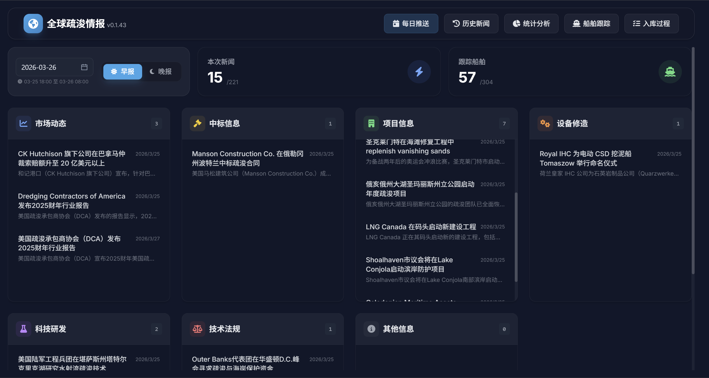
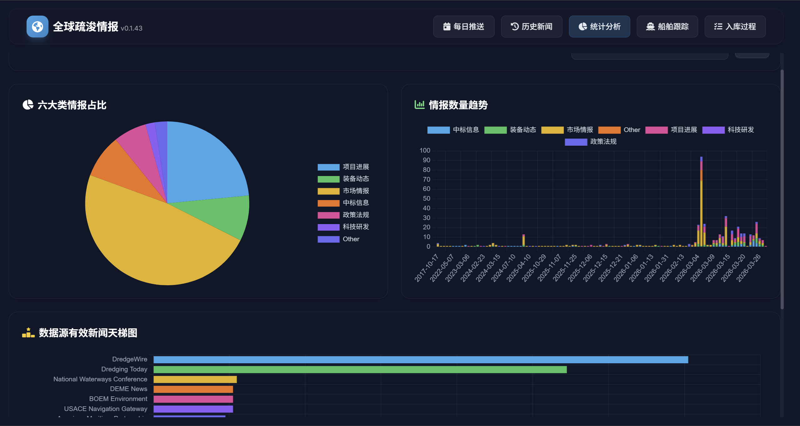

# DredgeScope（全球疏浚情报）

面向全球疏浚行业的情报采集、分析与可视化系统，支持新闻抓取、AI 分析、情报结构化提取、仪表盘展示与企业微信推送。

## 界面预览

| 首页 - 船舶分布与跟踪 | 统计分析 - 情报趋势分析 |
|:---:|:---:|
|  |  |

## 主要能力
- **多源新闻采集**：RSS 订阅源 + 网站索引页抓取
- **AI 智能分析**：基于 LLM 与 VLM 进行标题翻译、摘要生成、事件抽取与垃圾信息过滤
- **情报归档**：结构化入库与可追溯归档
- **可视化展示**：大屏仪表盘（自动适配早/晚报时段）、历史新闻筛选、船舶跟踪与分布展示（支持天地图/ArcGIS 切换）
- **自动推送**：每日生成简报并推送到企业微信
- **健康监控**：采集源状态实时监控与告警

## 新闻数据源

当前系统监控 **24** 个全球疏浚行业核心数据源。

### 数据源分布

| 类型 | 数量 | 采集策略 | 特点 |
| :--- | :--- | :--- | :--- |
| **Web** | 13 | Playwright 动态渲染 | 覆盖国际承包商、协会、官方机构 |
| **RSS** | 6 | Feedparser 标准解析 | 行业主流媒体，实时性高 |
| **WeChat** | 5 | RSSHub 微信公公众号 | 中交疏浚系官方账号 |
| **总计** | **24** | 混合采集模式 | 全方位覆盖 |

### 完整数据源清单

#### 🌍 国际行业媒体 (RSS)
- **Dredging Today**: 行业头部媒体
- **DredgeWire**: 国际即时资讯
- **MarineLog (Dredging)**: 海事与航道工程
- **Waterways Journal**: 内河与航道开发
- **Pile Buck Magazine**: 桩基与海洋工程
- **Great Lakes Dredge & Dock**: 美国最大疏浚商

#### 🏢 国际承包商与组织 (Web)
- **四大疏浚巨头**: Van Oord, Boskalis, DEME
- **行业协会**: IADC, CEDA, DCA
- **官方机构**: USACE, BOEM
- **区域组织**: National Waterways Conference

#### 🇨🇳 中国核心渠道 (Web + WeChat)
- **行业协会**: 中国疏浚协会 (CHIDA)
- **中交疏浚**: 官网 + 微信公众号
- **中交天航局**: 官网 + 微信公众号
- **中交上航局**: 官网 + 微信公众号
- **中交广航局**: 官网 + 微信公众号
- **长江航道**: 微信公众号

## 核心架构

系统采用 **四阶段流水线** 处理全球疏浚情报：

```
采集层 → 入库层 → 增强层 → 分析层 → 输出层
```

1. **采集层**：多源并行获取，支持 72 小时时间窗口
2. **入库层**：URL 去重和时效初筛
3. **增强层**：Playwright 深潜详情页，获取正文和截图
4. **分析层**：VLM 视觉分析 + Text LLM 文本分析
5. **输出层**：日报生成、企业微信推送、Dashboard 展示

## 项目结构

```
dredgescope/
├── backend/                 # Python 后端
│   ├── acquisition/         # 采集模块 (RSS, Web, WeChat)
│   │   └── sources/         # 采集源实现
│   ├── analysis/            # 分析模块 (LLM, VLM)
│   ├── reporting/           # 报告与推送
│   ├── static/              # 静态配置
│   ├── data/                # 数据存储 (SQLite)
│   ├── config.py            # 全局配置
│   ├── database.py          # 数据库模型
│   ├── main.py              # 采集入口
│   └── scheduler.py         # 任务调度
├── frontend/                # Vue 3 + TypeScript 前端
│   └── src/
│       ├── views/           # 页面
│       ├── components/      # 组件
│       └── stores/          # Pinia 状态
├── docker-compose.yml       # Docker 编排
├── AGENTS.md                # AI Agent 代码规范
├── CLAUDE.md                # 项目导航
└── .env                     # 环境变量
```

## 技术栈

| 层级 | 技术 |
|------|------|
| **前端** | Vue 3.4+, TypeScript 5.4+, Vite 5.2+, Ant Design Vue 4.x, Tailwind CSS, Pinia, Leaflet |
| **后端** | Python 3.11+, FastAPI, Uvicorn, Playwright, Feedparser, BeautifulSoup4 |
| **AI/LLM** | SiliconFlow (Qwen2.5), Aliyun DashScope (Qwen-VL) |
| **数据库** | SQLite |

## 运行指南

### 环境要求
- Python 3.11+
- Node.js 20.13.0+ (pnpm 7+)
- Docker & Docker Compose (部署用)

### 快速开始

1. **安装依赖**:
   ```bash
   # 后端
   cd backend && pip install -r requirements.txt
   playwright install chromium

   # 前端
   cd frontend && pnpm install
   ```

2. **配置环境**:
   创建 `.env` 文件：
   ```env
   Public_ALIYUN_API_KEY=your_key
   TEXT_LLM_API_KEY=your_key
   WECOM_WEBHOOK_URL=your_webhook
   ```

3. **启动项目**:
   ```bash
   # 本地开发
   run_dev.bat

   # Docker 部署
   docker-compose up -d
   ```

### 常用命令

```bash
# 手动采集
cd backend && python run_tasks_manually.py

# 测试模式
cd backend && python run_tasks_manually.py --test

# 代码检查
ruff check backend/
pnpm run lint --prefix frontend/
```

## 配置说明

### 采集源配置 (`backend/static/sources.json`)

```json
// RSS 源
{
    "name": "Dredging Today",
    "url": "https://dredgingtoday.com/feed/",
    "type": "rss"
}

// Web 源
{
    "name": "Van Oord News",
    "url": "https://www.vanoord.com/en/updates/",
    "type": "web",
    "selector": "article, .news-item",
    "url_patterns": ["/updates/", "/news/"],
    "blacklist": ["/user/", "/login"],
    "max_links": 15
}
```

## 健康监控

系统内置采集源健康监控：
- **监控指标**: 获取条目数、新增条目数、响应时间、错误信息
- **告警机制**: 连续失败自动告警
- **API 接口**: 
  - `GET /api/source-health/summary` - 健康状态摘要
  - `GET /api/source-health/alerts` - 告警列表

## 文档索引

- [AGENTS.md](./AGENTS.md) - AI Agent 代码规范
- [CLAUDE.md](./CLAUDE.md) - 项目导航

## 更新日志

### 2026-03
- 扩大 RSS 时间窗口至 72 小时
- 新增采集源健康监控
- 优化企业微信推送卡片显示
- 重构项目文档结构

## 许可证

MIT License
